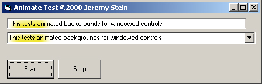



## Animate Windowed Control Background

### Description

Animate the background of windowed controls (text boxes, combo boxes, etc...)
 
### More Info
 

             |
---                |---
**Submitted On**   |2000-11-16 05:39:36
**By**             |[Jeremy Stein](https://github.com/Planet-Source-Code/PSCIndex/blob/master/ByAuthor/jeremy-stein.md)
**Level**          |Intermediate
**User Rating**    |4.5 (27 globes from 6 users)
**Compatibility**  |VB 6\.0
**Category**       |[Graphics](https://github.com/Planet-Source-Code/PSCIndex/blob/master/ByCategory/graphics__1-46.md)
**World**          |[Visual Basic](https://github.com/Planet-Source-Code/PSCIndex/blob/master/ByWorld/visual-basic.md)
**Archive File**   |[CODE\_UPLOAD1173211162000\.zip](https://github.com/Planet-Source-Code/jeremy-stein-animate-windowed-control-background__1-12827/archive/master.zip)

